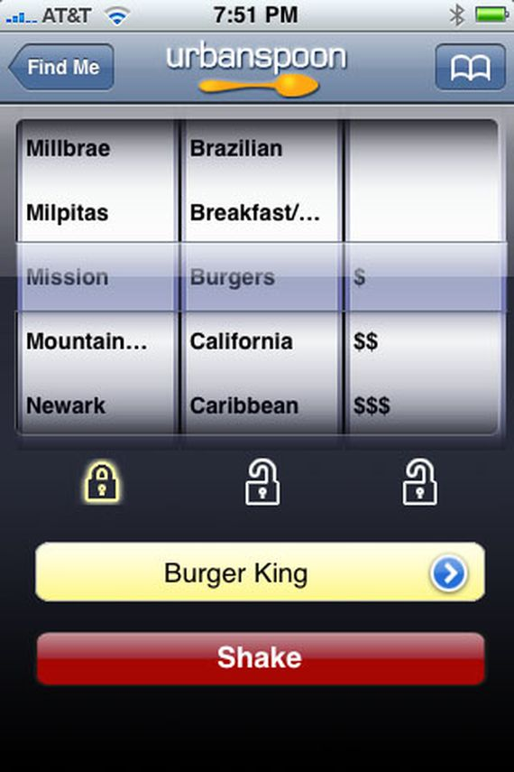

# Recipe Unlimited Flutter Coding Challenge

Thank you for your interest in Recipe Unlimited's engineering team.  The purposes of this challenge is to assses your knowledge of Flutter and application design.

You will we reviewed based on the following items:
* Building a responsive app with Flutter
* Write clean, easy to understand code
* Proper seperation of concerns between UI, Business Logic and Network Requests.
* Effective use of Unit Tests

**Please don't introduce any new dependencies**  You should be able to complete this challenge with every included in the project.

This challenge should take no longer than **2-3** hours to complete

## Urban Spoon Clone

In this challenge you will be building a simple client for the Zomato API. https://developers.zomato.com/api

The app will recreate the old urbanspoon app to help users pick a restaurant.

### Part 1

At the top of the screen there should be a text field to allow users to entire their location or use Location Services to get that information automatically.

### Part 2

Underneath, there should be three slot machine like spinners filled with data from the Zomato api. The three columns should be

* Neighbourhood
* Cuisine
* Price

Users should be able to loop through these three columns and lock any or all of them.

Below the slot machine there will be a spin button that will rotate any of the unlocked columns.  After the columns are done spinning, the app will query Zomato to get a list of Restaurants.

### Part 3

This restaurant list is then pushed to a new screen where users can scroll through the list an selected their favourite restaurants.

# Getting Started

To get started, clone this repo to your local machine.  Build the app against the `stable` Flutter channel.

# Submission

To submit your coding challenge, create a pull request and to submit it to this repo.
Please also email engineering@recipeunlimited.com to let us know that you have completed the challenge. We do our best to review and respond to submissions within 1-2 business days.

Thanks for taking the time to do this coding challenge and here's hoping we talk soon!

